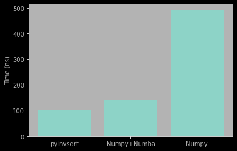

<h1 align='center'> Fast Inverse Square Root in Python </h1>

Made (in)famous by the original implementation in the Quake 3 Arena source code, where fast inverse square roots are vital for perfoming vector operations for game physics, the Fast Inverse Square Root is an extremely clever bit/memory hack, that avoids using slow division instructions, and replaces everything with rapid bit-shifts to calculate an approximation to, f(x) =  \frac{1}/{\sqrt{x}}.

## Requirements

- gcc
- conda/miniconda

## Install

```bash
conda install -c skailasa pyinvsqrt
```

## Usage

```python
import numpy as np

from pyinvsqrt import invsqrt

# Only 32 Bit compatible
x = np.float32(10)

# Compute inverse square root
y = invsqrt(x)
```

## Benchmark

Compared with a pure Numpy (BLAS backend) inverse square root, pyinvqrt is almost 400% faster, and almost 35% Faster when compared to a Numba-fied implementation.


